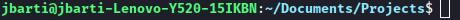

# Autostopistički priručnik za Python

## Predgovor

Ova skripta namijenjena je studentima i srednjoškolcima koji pohađaju PyOpen workshopove. Ovo nije knjiga koja se bavi svim značajkama ovog jezika već samo priručnik u učenju koji sadrži velik broj zanimljivosti i uputa za izradu projekata koji će se raditi na spomenutom workshopu.

Naravno ako ikoja izgubljena duša slučajno naiđe na ovu literaturu dozvoljeno joj je koristit ju u svrhu samostalne edukacije.

P.S. Unaprijed se ispričavam na svim gramatičkim i mnogim drugim pogreškama u pisanju. Ako imate prijedlog kako unaprijediti ovu skriptu ili pak osjećate *susramlje* prema mom lošem poznavanjeu strukture rečenice u Hrvatskom jeziku više ste nego dobrodošli napraviti pull request ili objaviti issue.


## Referencirana literatura 

1. [The Hitchiker's Guide to Python.pdf](http://index-of.es/Varios-2/The%20Hitchiker%27s%20Guide%20to%20Python.pdf)

2. [Is Python interpreted or compiled](https://nedbatchelder.com/blog/201803/is_python_interpreted_or_compiled_yes.html)

3. [Diskusija na Quori o tome što je command prompt a što command line](https://www.quora.com/Is-command-line-and-command-prompt-the-same-tool)

4. [What is a REPL](https://codewith.mu/en/tutorials/1.0/repl)

5. [Python Crash Course](http://bedford-computing.co.uk/learning/wp-content/uploads/2015/10/No.Starch.Python.Oct_.2015.ISBN_.1593276036.pdf)


## Komedija, zmija ili programski jezik

Python, nama danas poznat kao *high level, open source* programski jezik, stvoren je 1980-ih godina u Nizozemskoj.

Tada mladi računalni znanstvenik pod imenom Guido van Rossum radio je na Državnom Istraživačkom Institutu za Matematiku i Računalne Znanosti u Amesterdamu. Bio je dio skupine znanstvenika koja se bavila razvijanjem Amoeba operacijskog sustava i na božić 1989 godine stvorio je Python sa svrhom da bude skriptni jezik koji bi olakšao sistem administraciju u Amoeba os-u.

Ubrzo je Python prerastao iz malog skriptnog jezika u jedan od najpopularnijih programskih jezika na svijetu a u svrhu njegovog održavanja, promoviranja i razvoja stvoren je *Python Software Foundation*.

S obzirom da je logo Pythona zmija većina ljudi misli da je ovaj programski jezik ime dobio po egzotičnoj, ubojitoj životinji, međutim Guido sam govori kako ga je imenovao prema BBC-evoj popularnoj humorističnoj eriji *Monty Python’s Flying Circus*


## Na što mislimo kada kažemo Python

Sama riječ Python označava skup pravila koji definiraju jedan specifični programski jezik. Ali kada od nekog čujete da programira u Pythonu ta osoba najčešće želi reći da programira u specifičnoj implementaciji tog skupa pravila koja se naziva CPython koju ćemo i mi koristiti na radionicama.

**CPython** je implementacija našeg specifičnog skupa pravila pomoću C programskog jezika. To je ona verzija Pythona koju dobijete kada skinete Python sa [python.org](https://www.python.org/downloads/) stranice i uz to je i originalna verzija Pythona koja prva implementira nove featureove. Na ovu verziju ćemo se i mi referirati kada budemo pričali o Pythonu. Pogodnost ove implementacije Pythona je ta što može pozivati kod pisan u C programskom jeziku što doprinosi brzini izvođenja programa.

Osim CPythona postoji još zanimljivih implementacija.

**Jython** je implementacija Pythona u programskom Jeziku javi. Jython kompajla Python kod u Java bytecode i omogućuje njegovo pokretanje unutar Java virtualne mašine (JVM). Uz to korištenje Jythona programeru otvara mogućnost korištenja Java biblioteka i klasa zajedno sa Python kodom.

**Skulpt** je compiler koji prevodi Python u JavaScript, može se pokretati direktno iz web preglednika i koristi se u edukacijske svrhe.

**RPython** je kompajer koji prevodi Python kod u C i nad programerom podstavlja ograničenja *strictly typed* programskih jezika. RPython ne nazivamo Python implementacijom zbog toga što sav Python kod ne možemo smatrati RPython kodom, ali sav kod koji možemo pokrenutir RPythonom, standardna implementacija PYthona može također pokrenuti. Zbog toga RPython najčešče nazivamo podskupom Python jezika.

Na ovom primjeru možemo uočiti razliku između standardnog Pythona i RPythona:


```python
#FUNCTIONS
def add(x,y):
 return x + y

#MAIN CODE
add(1, 2)
add("Mirko", "Slavko")
```

U standardnom Pythonu primjer ovakvog koda je sasvim validan. Međutim RPython koji prevodi naš python kod u *strictly typed* programski jezik mora poznavati koji tip argumenata prima funkcija `def add(x, y)`. U prvom pozivu funkcije add `add(1, 2)` RPython kompajler opaža da smo proslijedili dva *integera* pa funkciju add deklarira kao funkciju koja kao argumente prima dva *integera*.
Prilikom drugog poziva funkcije `add("Mirko", "Slavko")` proslijedili smo kao argumente dva *stringa* što se protivi prethodnoj deklaraciji funkcije i zbog toga nam program javlja grešku.

```
[translation:ERROR] In <FunctionGraph of (rtest:9)main at 0x103f7dc58>:
[translation:ERROR] Happened at file rtest.py line 11
[translation:ERROR]
[translation:ERROR]       print add(1,2)
[translation:ERROR] ==>   print add('Graham','Jenson')
```


## Verzije Python interpretera

Ako posjetite službenu [download stranicu pythona](https://www.python.org/downloads/) susrest će te se sa velikim izborom aktivnih verzija Python interpretera različitih verzija.

| Version       | Maintanance status |
| ------------- | ------------------ |
| 3.9           | bugfix             |
| 3.8           | bugfix             |
| 3.7           | security           |
| 3.6           | security           |
| 3.5           | end-of-life        |
| 2.7           | end-of-life        |

S obzirom da online Python tutoriali i knjige često datiraju i do 10 godina unatrag te različite verzije nazivaju najboljim ili aktualnim, novopridošlim python developerima zna često biti težak ovaj izbor.

Pa da ukratko objasnimo. Python 2.7 tj. posljednja je verzija Pythona 2 interpretera izašla 2010. godine. Python 2 dostigao je kraj svog životnog ciklusa. To bi značilo da developeri više ne rade na podršci za njega, ne izadaju se novi paketi kompatibilni snjim, ne prima bugfixove, a i sam po sebi je u usporedbi s novom Python 3 verzijom zastarjel.

Python 3 je trenutno najkorištenija verzija Python interpretera, najkorištenije njegovo izdanje je inačica Python 3.8.5, a nedavno smo dobili priliku koristiti i verziju 3.9 koja dodaje velik broj novih featureova u Python jezik.

Bitno je zapamtiti da su sve verzije Python interpretera unutar neke serije (gdje bi serije bile Python 3 serija i Python 2 serija) kompatibilne sa prethodnim verzijama unutar te serije, ali ne i obrnuto.


## Instalacija Pythona

- Linux: `sudo <štagodveć> install python3`
- MacOS: `sudo brew install python3`
- Winodws: `pronađeš ga u Microsoft storeu...3`

Najbitniji dva alata koja dobijete pokretanjem instalacije Pythona su:
 
 - python interpreter
 - python REPL
 - pip
 
S obzirom da su sve te tri stvari nešto što nazivamo *CLI aplikacije* bilo bi lijepo da malo popričamo tome što su: *konzola/terminal*, *shell* i *CLI*.


## Komandna linija ili terminal ili konzola

*CLI* je kratica za command line interface (ilitiga *sučelje naredbenog retka*), suprotno od *GUI* što je kratica za graphical user interface (ilitiga *grafičko korisničko sučelje*).

Za razliku od GUI aplikacija, koje koristimo klikanjem na razne botune, CLI aplikacije koristimo pozivajući određene naredbe u terminalu.

Terminal je korisničko sučelje kojeg koristimo pomoću tekstualnih komandi umjesto botuna. Takav pristup korištenju softwarea omogućava nam jednostavnu automatizaciju dosadnih i svakodnevnih operacija. Korištenje tekstualnih komandi najčešće je brže i fleksibilnije od korištenja grafičkog sučelja.
Jedan primjer automatizacije dosadne operacije bio bi kompajliranje i pokretanje c programa zajedno sa njegovim bibliotekama:

```bash
gcc -Wall -g -c tree.c
gcc -g main.c tree.o

# Fun fact, gcc ili "gnu c compiler" pisan je u c programskom jeziku i svaka iduća 
# verzija kompajlira se pomoću prethodne verzije.
```


ili gledanje Star Warsa... točnije ASCII Star Warsa napravljenog od 50275 linija dugog .txt filea:
```bash
telnet towel.blinkenlights.nl
```

Možemo reći da se terminal sastoji od dva dijela: *command prompta* i *shell jezika*.

Kada pokrenemo terminal prva stvar koja nas doečeka je command prompt.



To je linija koja od nas traži komandu te nakon što je upišemo i udremo enter, prompt je prosljeđuje shellu. Osim toga prompt nam prikazuje i neke korisne podatke poput: 

- trenutnog aktivnog korisnika (*jbarti*) 
- ime uređaja (*jbarti-Lenovo-Y520-15IKBN*)
- direktorij u kojem se nalazimo (*~/Documents/Projects*). Slika iznad prikauje nam default prompt bash shella.
- oznaku da možemo nastaviti unositi podatke (*$*)

Komande koje unosimo u prompt izvršavaju se unutar određenog direktorija. Program koji je zadužen za izvršavanje komandi je interpreter *shell jezika*.

Jezik pomoću kojeg komuniciramo s našim terminalom, a preko njega s operativnim sustavom zovemo *shell*. Vjerojatno ste se već i susreli s nekim od njih. Na Windowsima imamo: cmd.exe i PowerShell, na UNIX based sustavima imamo: bash, fish, zsh... Jedan od prvih i najpoznatijih shell jezika kojeg su možda i neki učili u osnovnim školama dok je informatika još bila izborni predmet bio je QBasic.

Shell jezici imaju jako oskudan broj predefiniranih operacija koje mogu izvršavati, najčešće su to samo matematičke operacije, petlje, grananja i komande za baratanje sa direktorijima, što zvuči okej, ali kako onda hakeri u filmovima mogu hakovati hakujući samo u terminalu ?

Odgovor na to su *CLI aplikacije*. Osim što unutar shella možemo koristiti *built in* komande, možemo sami napisati (ili češće downloadati) neku drugu komandu. Ta komanda nije ništa drugo nego program pisan u nekom interpretiranom jeziku ili binarni kod dobiven iz nekog kompajliranog jezika, koji prilikom izvršavanja može primati tekstualne argumente.

Nekakav nepisani dogovor je da postoje dvije vrste tekstualnih argumenata koje prosljeđujemo CLI aplikaciji, a to bi bile:

- opcije izvršavanja
- podatci nad kojima se izvršava aplikacija

Primjer takve komande bio bi:
```bash
python -i test.py
```

Gdje `-i` opcija koja oznaćava pokretanje interpretera u interaktivnom modeu, a `test.py` je file kojeg želimo pokrenuti, tj podatci nad kojima se pokreće aplikacija.


Ponekad CLI aplikacije mogu imati i podkomande, jedan takav primjer bio bi:
```bash
pip install ime_nekog_paketa
```

Gdje je `install` podkomanda komande `pip`.

Postoje dvije opcije koje bi svaka *CLI aplikacija* trebala imati, a to su `-v` koji pokazuje verziju aplikacije i `-h` koji pokazuje upute korištenja.


## Python alati

Vratimo se nazad na alate koje smo dobili instalacijom pythona.

### Python interpreter
Python interpreter je program kojem proslijedimo python file, on ga zatim kompajlira ui bytecode i taj bytecode se izvršava pomoću interpretera. Taj međukorak kompajliranja pythona u CPython implementaciji koju koristimo omogućava nam prepoznavanje grešaka u kodu prije izvršavanja samog koda. Ako među čitateljima postoji vanilla JavaScript developer znati će cijeniti ovu činjenicu.

Python interpreter pozivamo shell komandom:
```bash
python neki_file.py 
```

### Python REPL
Vjerovali ili ne REPL nije riječ engleskog vokabulara već akronim nastao od riječi:
 - **R**ead the user input (očitavanje Python komande)
 - **E**valuate your code (dokućiti što označava kod)
 - **P**rint any results (ispiši rezultat komande)
 - **L**oop back to step one (vrati se na prvi korak)

REPL možemo zamisliti i kao prompt koji kao shell jezik koristi Python. Pokrećemo ga shell komandom:
```bash
python
```

### pip

Pip je također akronim koji znaći:
 - **P**ackage **I**nstaller
 - for ???
 - **P**ython

To je program koji nam omogućava downloadanje paketa sa *Python package indexa* (i ostalih indexova). Python package index je repozitorij skftwarea pisanog za Python programski jezik.

U prijevodu to znaći da bilo koji developer može napisati Python skriptu i uploadati je kao paket na *PyPi* (Python package index), nakon toga bilo tko drugi može preuzeti taj kod i koristiti ga u svom projektu. Sav kod objavljen na PyPi je open source.

Pip je razlog zbog kojeg je Python popularan. Danas postoji preko 250,000 projekata samo na PyPiu, kojeg slobodno možete koristiti i iz kojeg možete učiti pisati Python.

Komanda za instalaciju paketa pomoću pipa glasi:
```bash
pip install ime_nekog_paketa
```


## The zen of python

Da bi naućili kako pisati Python prvo trebamo znati kako **kako** pisati dobar Python.

``` python
>>> import this                                                                  
```
```
Beautiful is better than ugly.
Explicit is better than implicit.
Simple is better than complex.
Complex is better than complicated.
Flat is better than nested.
Sparse is better than dense.
Readability counts.
Special cases aren't special enough to break the rules.
Although practicality beats purity.
Errors should never pass silently.
Unless explicitly silenced.
In the face of ambiguity, refuse the temptation to guess.
There should be one-- and preferably only one --obvious way to do it.
Although that way may not be obvious at first unless you're Dutch.
Now is better than never.
Although never is often better than *right* now.
If the implementation is hard to explain, it's a bad idea.
If the implementation is easy to explain, it may be a good idea.
Namespaces are one honking great idea -- let's do more of those!
```

Ovih 20 aforizama odgovaraju nam na prethodno postavljeno pitanje. Prema njima se vodi razvoj svake iduće verzije Pythona. Kako točno implementiramo Pythonov zen u pojedinoj verziji programskog jezika govori nam [PEP8 - Style Guide for Python Code](https://www.python.org/dev/peps/pep-0008/).


# Vrijeme je da počnemo programirati
